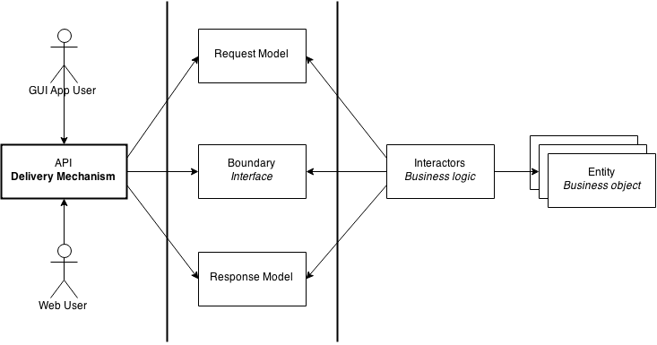
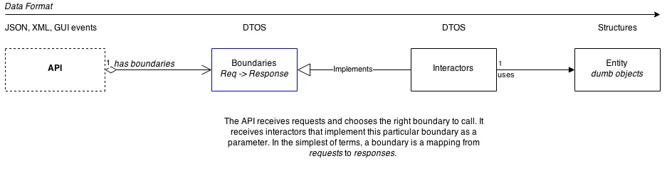

The Architecture
================

   An overview of all the logical units of the architecture.

The architecture can be approached from two different perspectives. The
first is the dependency graph, as you can see above. The second is the
hierarchy graph, which presents a concrete separation in a program.

The architecture is best described as a *functional data-driven*
architecture, where requests are processed into results. The
architecture consists of three different components.

*  **Entities** are the core of the architecture. Entities represent
   business objects that have application independent business rules.
   They could be ``Book``\ s in a library or ``Employee`` in an employee
   registry. All the application agnostic business rules should be
   located in the entities.

*  **Boundaries** are the link to the outside world. A boundary can
   implement functionality for processing data for a graphical user
   interface or a web API. Boundaries are functional in nature: they
   accept data *requests* and produce *responses* as result. These
   abstractions are concretely implemented by interactors.

*  **Interactors** manipulate entities. Their job is to accept requests
   through the boundaries and manipulate application state. Interactors
   is the business logic layer of the application: interactors *act* on
   requests and decide what to do with them. Interactors know of request
   and response models called **DTOs**, data transfer objects.
   Interactors are **concrete** implementations of boundaries.

   An object diagram of the program.
