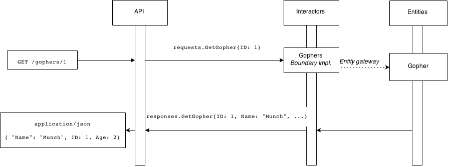
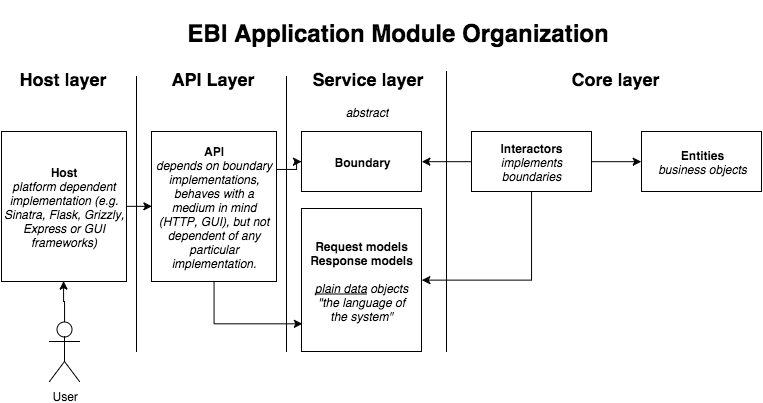

Description
===========

Request and Response Life-cycle for Interactors
-----------------------------------------------

   The request life-cycle of incoming requests and responses.

A *request DTO* enters the application via the request boundary. This is
usually the API layer sitting on top of some interactor. In the pictured
example, we have a ``GetGopher`` interactor whose task is to retrieve
information about a store of gophers, accepting ``GopherRequest``\ s and
returning ``GopherResponse``\ s. The *user interaction* is the request
DTO and in this example is in plain JSON.

The interactor ``GetGopher`` then can be seen as a mapping of
``GetGopherRequest``\ s to ``GopherResponse``\ s. Because the requests
and responses are **plain dumb objects**, this implementation is not
dependent of any technology. It is the duty of the API layer to
translate the request from, e.g., JSON, to the request DTO, but the
interactor doesn't know anything about the protocol or its environment.

What does a program using this architecture look like?

Layer Hierarchy
---------------

   The code-level organization of modules. Each vertical section is an
   separate module of the program.

Furthermore, it is good practice to separate the EBI architecture itself
into five different layers. These layers correspond to namespaces or
packages in your language of choice.

-  The **Host** layer implements a physical manifestation of the API,
   e.g., a web server
-  The **API** layer is the interface to the program itself, which
   accepts input and translates it into DTOs, passing them to
-  The **Service** layer that contains **boundaries** and **response**
   and **request** models
-  The **Core** layer that contains a concrete implementation of the
   service layer
-  **Interactors** which implement boundaries and form the core business
   logic of the application
-  **Entities** which represent the data models of the program

Thus, when a program is constructed, the API is built top-down using
dependency injection. The **Host** layer is the one doing the DI of the
concrete interactors.

And that's it. The interactors do not know what protocol its requests
come from or are sent to, and the API doesn't know what sort of an
interactor implements the service boundary.

Example Implementation: A REST API in in Elixir
-----------------------------------------------

This document features a small example implementation of this
architecture in *Elixir*. Elixir is a dynamically typed language
leveraging the Erlang virtual machine.

I chose Elixir because of its simple but powerful syntax. I originally
wanted to implement this in Ruby but I wanted clear examples of
*interfaces* and Ruby doesn't really have them. Thankfully, Elixir has
*protocols*, which let me write the boundary descriptions using a
high-level abstraction.

.. note:: Interfaces aren't absolutely necessary.

   You don't really *need* interfaces to implement boundaries, it just
   makes it easier to browse. For Ruby and Python you could easily
   write a dummy abstract class with ``NoMethodImplementation``
   exceptions being thrown left and right, in case of an unsatisfied boundary.

The Elixir implementation makes the use of the `Spirit
<https://github.com/citrusbyte/spirit>`_ microframework for
Elixir. Equivalent frameworks in other applications:

- **Ruby**: Sinatra, Cuba
- **JavaScript**: Express
- **Go**: net/http
- **C#**: ServiceStack
- **Java**: SparkJava

...and so on.

::

    .
    ├── api
    │   └── web.ex
    ├── core
    │   ├── entities
    │   │   ├── entity.go
    │   │   └── gopher.go
    │   └── interactors
    │       └── gophers.go
    ├── host
    │   └── webserver.go
    ├── main.go
    └── service
        ├── requests
        │   └── gopher.go
        ├── responses
        │   └── gopher.go
        └── service.go
        └── gophers.go
