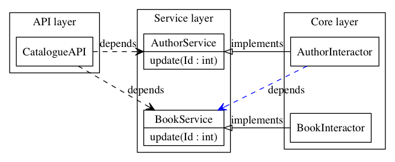

Implementation
==============

From the directory tree one can see that the code is organized into
separate namespaces. In the example implementation this is achieved by
splitting the code into different folders, since this is a one-to-one
mapping to packages (namespaces) in the Go programming language.

The ``api`` folder contains the API, the ``host`` web servers or GUI
apps, the ``service`` contains the boundary layer with the request and
responses models, the ``core`` layer contains the core program
architecture hidden from view.

As mentioned previously, the purpose of the program should be visible by
looking at it. By exploring the ``service`` directory (containing
``gophers.go`` *et al.*) we can immediately see the services this
program provides.

The Service Layer
-----------------

The common language spoken by the boundaries and interactors are
requests and responses. Both interfaces are defined in ``service.go``.

We can now implement the Gophers service (which finds and stores
gophers) in ``service/gophers.go``.

.. code:: go

    package service

    import (
        "github.com/ane/ebi/service/requests"
        "github.com/ane/ebi/service/responses"
    )

    // Gophers is a boundary that can do things with gophers.
    type Gophers interface {
        Create(requests.CreateGopher) (responses.CreateGopher, error)
        Find(requests.FindGopher) (responses.FindGopher, error)
        FindAll(requests.FindGopher) ([]responses.FindGopher, error)
    }

Boundary complexity
~~~~~~~~~~~~~~~~~~~

The above code presented a rather simple boundary, composed of just two
methods. This is obviously suitable for a simple web application, but
this is not the design goal of boundaries. The purpose of boundaries is
to *decouple* the application interface and its implementation from each
other.

When writing boundaries, there aren't any limits to their complexities.
They can contain just one method or a dozen method.

.. tip::
   
   In Go, it is idiomatic to aim for interface composition. The ``Gophers``
   boundary above is composed of two distinct interfaces. This allows for
   extensibility.

Though similar to multiple inheritance, Go interfaces allow for
decomposition. In Java you could define a class
``FinderCreator implements Finder, Creator`` but you **cannot decompose
them**. This means that in Go, it is entirely valid to define a function
``func Foo(c Creator)`` yet pass a ``FinderCreatorRemoverUpdater`` to it
as a parameter. In Java or its family you can't decompose multiple
inheriting classes or interfaces into their constituent interfaces.

The take-away points of boundary design are these:

1. Make loose coupling easy by defining abstract interfaces that aren't
   too monolithic.
2. Decompose if you can if your interfaces are too big, think about
   splitting them into modular parts.
3. Make boundaries synchronous. Calling them asynchronously in the API
   layer is easy. Make them mappings from requests to responses.

Request models
~~~~~~~~~~~~~~

Once the boundaries are complete, then we can move to the request and
response models. These are implemented with simple structures that
contain no validation logic. They are simply information vectors.

In our example, the response and request models live in
``responses/gophers.go`` and ``requests/gophers.go``.

.. code:: go

    package requests

    type FindGopher struct {
        ID int
    }

    type CreateGopher struct {
        Name string
        Age  int
    }

.. code:: go

    package responses

    type FindGopher struct {
        ID   int
        Name string
        Age  int
    }

    type CreateGopher struct{
        ID  int
    }

Designing good DTOs
^^^^^^^^^^^^^^^^^^^

DTOs have no business logic. Think of them as language constructs around
simple requests not dependent of any protocol.

In our Go program, the naming convention is to have a service "Foobar"
(in caps, can be a pluralized noun), and have it in
``service/foobar.go``, and its request and response models are *all* in
``service/requests/foobar.go`` and ``service/responses/foobar.go``.

Though these interfaces are named similarly, in Go, we refer to these
types as ``requests.FindGopher``, hence it is never ambiguous as to what
the structures are. The ``requests`` (or responses) packages contain
only structures like these, hence there will never be any confusion
between the two.

In other languages, you would usually have a suffix of some sorts or use
a namespace explicitly to avoid repetition.

Wrapping up
^^^^^^^^^^^

The service layer is the common language of the application
architecture. When the API and core speak to each other, they do so via
an abstract boundary. They use DTOs (data transfer objects), simple
structures of data, for communication. We now move on to the core layer
of the architecture.

The Core Layer
--------------

The core layer contains actual business logic. First we start off with
the entity, the rich business objects of the application. In
``core/entities/entity.go``,

.. code:: go

    type Gopher struct {
        Name string
        Age int
    }

Entities are completely invisible to the outside layers. Not any thing
but the interactors know about them. Entities contain business logic,
e.g., a ``Gopher`` entity can modify itself or contain functions related
to it, but the distinction between entities and interactors is the
following:

-  entities modify *themselves* vs.
-  interactors modify *entities*

An entity can contain other entities: a ``Gopher``, could technically
possess a ``Tail`` and two ``Eye``\ s, and it can modify them at will.
This hierarchy is strictly unidirectional: a ``Gopher`` doesn't know
about other gophers, more importantly, *it doesn't know about the
interactor*.

Interactors
~~~~~~~~~~~

Interactors contain rich business logic. They can manipulate entities
and they implement boundaries. Here, we have the ``Gophers`` boundary
from above to implement, so we implement a smallish interactor that
implements it.

.. code:: go

    type Gophers struct {
        burrow map[int]entities.Gopher
    }

    func NewGophers() *Gophers {
        return &Gophers{
            burrow: make(map[int]entities.Gopher),
        }
    }

It implements the three methods as defined by the ``Gophers`` boundary

.. code:: go

    // Find finds a gopher from storage.
    func (g Gophers) Find(req requests.FindGopher) (responses.FindGopher, error) {
        gopher, exists := g.burrow[req.ID]
        if !exists {
            return responses.FindGopher{}, errors.New("Not found.")
        }

        return gopher.ToFindGopher()
    }

    func (g Gophers) FindAll(req requests.FindGopher) ([]responses.FindGopher, error) {
        var resps []responses.FindGopher
        for _, gopher := range g.burrow {
            fg, err := gopher.ToFindGopher()
            if err != nil {
                return []responses.FindGopher{}, err
            }
            resps = append(resps, fg)
        }
        return resps, nil
    }

    // Create creates a gopher.
    func (g Gophers) Create(req requests.CreateGopher) (responses.CreateGopher, error) {
        var gopher entities.Gopher
        if err := gopher.Validate(req); err != nil {
            return responses.CreateGopher{}, err
        }

        gopher.ID = g.getFreeKey()
        gopher.Name = req.Name
        gopher.Age = req.Age
        g.burrow[gopher.ID] = gopher

        return responses.CreateGopher{ID: gopher.ID}, nil
    }

As one can see, the interactor is completely unaware of any protocol
dependencies. The relation to web applications is obvious: we are, after
all, talking about requests and responses, and the DTOs translate very
easily to JSON objects. But they can be used without JSON, in fact, the
whole point is that even a GUI application will pass the same objects
around.

The interactors (and by extension, entities) are completely oblivious to
their environment: they don't care whether they are running inside a GUI
application, a system-level daemon, or a web server.

Beware of Behemoth Interactors
^^^^^^^^^^^^^^^^^^^^^^^^^^^^^^

Interactors are business logic units. How much business logic is too
much business logic? The best rule of thumb is the **single
responsibility principle**: an interactor should only do one thing, and
one thing only. I'm also going to address this
`below <#the-api-layer>`__, but the most important thing to understand
about interactors is that they should operate only one *one* aspect of
the business logic.

What this means may not be immediately clear. If you are building a REST
API, you will generally have some separation of concerns already going
on at the external API level, in the form of URIs. To use a book
catalogue as an ad hoc example, you could have a URI for book authors at
``/authors`` and ``/books``, these clearly indicate---to the API user,
anyway---what lies beneath.

At the code level, this distinction must be maintained. An author may
contain a collection of books they have, but whose responsibility is
modifying them? Obviously, since we have two URIs here, one for books,
one for authors, we must decide which one handles the logic of modifying
book entities. In this case, any internal *modification logic* of the
book entities must reside underneath a **single** interactor. There can
be two cases here:

-  **One interactor does everything**. The ``/books`` URI is just an
   alias underneath the Author interactor, or vice versa.

   -  **Pros**: no overlap in logic, no conflicts, since everything is
      contained under one unit (a single interactor).
   -  **Cons**: must be split eventually, since otherwise it will grow
      to monstrous proportions.

-  **Two interactors, ``AuthorInteractor`` and ``BookInteractor``**. The
   ``AuthorInteractor`` calls methods of the ``IBookService`` (which
   ``BookInteractor`` implements) to modify the ``Book`` entities
   contained (or *owned*) by an ``Author`` entity.

   -  **Pros**: no chance of overlap since the responsibilities are
      split.
   -  **Cons**: risk of introducing circular dependencies between
      boundaries (see `below <#the-api-layer>`__).

If you're building a really simple service, you don't *have* to split
interactor duties, but it's a good idea. Be careful of choosing
short-term practicality in favor of long-term abstractions, it may bite
you in the rear one day!

As a summary, in the presented example, the ``AuthorInteractor`` should
only modify things related to ``Author``\ s, and preferably only *read*
data about ``Book``\ s, leaving modification and updates to the
``BookInteractor``. There are two ways on how to implement the necessary
communication, that is, how the ``AuthorInteractor`` calls the
``BookInteractor``, and this will be resolved later, but now we have a
small interlude about something equally vital: the external world.

Talking to the External World
~~~~~~~~~~~~~~~~~~~~~~~~~~~~~

One part I haven't yet addressed in this overview is how to talk to
external dependencies, like a database. The answer is remarkably simple:
create them behind a boundary and build them like an interactor. This
enforces loose coupling, and the interactors *still* talk to each other
using interfaces.

Similarly, if you're building a GUI application and want to use events,
the interactor can push events to an event broker boundary, or the API
layer can handle the responses from the interactor, and call other
interactors through their boundary interfaces. This brings us to the API
layer.

The API layer
-------------

The introduction of the API layer at this point may seem a bit
heavy-handed. Why not map the interactor methods directly to routes? I
mean, you could spin up a web server that handles Sinatra-like requests
and then points them to the right interactor and returns a serialized
version of whatever the interactor spewed out.

Indeed, if you have *one* interactor or a couple that don't ever do
business together, this seems like the right approach. Once you get too
many, it gets useful to wrap them underneath a single unit.

Suppose you have an API endpoint of a book catalogue, and you want to
implement functionality that that modifies a particular author and at
the same time transfers these modifications to the publications. You
receive the new author name as input, and then you must update the
author itself and their book catalogue in one go.

Sure, sounds easy, just create a ``ModifyCatalogue`` functionality into
the ``Author`` interactor. The interactor, in this case, would modify
the author's name, then loop over its ``Book``\ s and modify them
individually, finally sending the updates to a database. This system
works as long as the ``Book`` entities are under the sole ownership of
an ``Author``--that is, there is no way of adding, creating, deleting,
or modifying a book from outside.

As soon as you introduce a ``Book`` interactor into the mix, things
start to get hairy. The ``Author`` service, retaining its book
modification logic, now overlaps with the ``Book`` service. The imminent
solution to this is to lift this logic from the ``Author`` interactor to
the ``Book`` interactor, making the layout look like this.

   Could the blue arrow be removed, and contained inside the arrows
   from the API layer pointing towards the Service layer?

The blue dashed arrow can be lifted into the API layer with little extra
work. It's a good idea to push such arrows as far "up" as possible,
because this helps keep one thing in check: not violating the **single
responsibility principle**, which roughly means that your interactor
should do one thing and **one thing only**. So the Author interactor
should only care about author logic, and the Book interactor should care
only about book issues.

In the above example this process would not be violated if there was no
Book service, such that book-related logic was underneath the Author
interactor. But, as soon as you start sharing responsibilities, and they
start to overlap, you will run into problems.

Hence, the API layer is there to provide additional logic that ties two
interactors together. You could think of it as a *meta-interactor*,
something that operates on interactors only, but contains no low-level
business logic.

What is more, the API layer usually has some knowledge of the
application domain: while interactors deal with dumb objects (DTOs), the
API may be dealing with HTTP request objects. Thus, the API is closer to
the actual implementation.

Consequently, the **Core** layer is the non-duplicated, non-overlapping
part of the application: you may have multiple APIs for the same set of
interactors, and multiple *hosts* for each API, but at the fundamental
level, there's only one canonical implementation of the core.

To conclude, the key differences between an API and an interactor are
the following:

-  An API is domain-specific and knows about the target implementation.
   The API knows it is talking to a web server. It just doesn't know
   *which kind* of web server it is talking to, acting as a bridge
   between interactors and the delivery mechanism.
-  The API layer may tie a multitude of interactors together, without
   making them dependent on each other, enforcing loose coupling.
-  APIs can be seen as "meta-interactors", operating on interactors the
   same way interactors operate on entities.

The Host Layer
--------------

TODO
