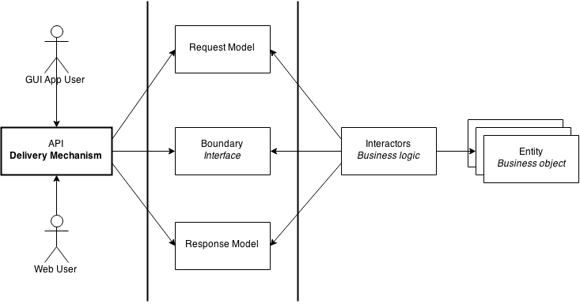
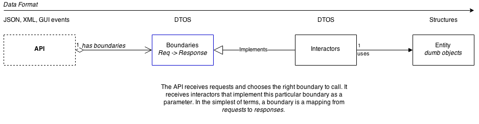

Introduction
============

.. epigraph::

    The architecture of something *screams* the intent.

    -- Robert C. Martin

As Martin points out, a lot of the times when looking at web
applications you see library and tooling artifacts, but the *purpose* of
the program is opaque. You open up a repository of a web application
and what you see is a load of configuration files, complicated
directory structures and lots of extraneous cruft that one day become
invisible. Could this opacity be avoided?

.. epigraph::

    The architecture of an application is driven by its use cases.

    -- Ivar Jacobsen

The idea is to design programs so that their architectures immediately
present their use case. EBI is a way to do that. It's a way to design
programs so that its modules are organized cleanly and its architecture
uses loose coupling to remain extensible.

Ultimately, the goal is the *separation of concerns* between application
layers, this architecture and many like it aren't dependent on
presentation models or platforms. All the arrows, or dependencies,
point inwards in the abstraction chain, each successive layer is
less abstract than the one before it.

Keeping the arrows pointing inwards makes the code easy to maintain,
extend, test and refactor. EBI imposes some architectural requirements
on the programmers, that is, you must navigate around its rules, but
this is kept at a minimum.

Glossary
--------

   An overview of all the logical units of the architecture.

The architecture can be approached from two different perspectives. The
first is the dependency graph, as you can see above. The second is the
hierarchy graph, which presents a concrete separation in a program.

The architecture is best described as a *functional data-driven*
architecture, where requests are processed into results. The
architecture consists of three different components.

-  **Entities** are the core of the architecture. Entities represent
   business objects that have application independent business rules.
   They could be ``Book``\ s in a library or ``Employee`` in an employee
   registry. All the application agnostic business rules should be
   located in the entities.

-  **Boundaries** are the link to the outside world. A boundary can
   implement functionality for processing data for a graphical user
   interface or a web API. Boundaries are functional in nature: they
   accept data *requests* and produce *responses* as result. These
   abstractions are concretely implemented by interactors.

-  **Interactors** manipulate entities. Their job is to accept requests
   through the boundaries and manipulate application state. Interactors
   is the business logic layer of the application: interactors *act* on
   requests and decide what to do with them. Interactors know of request
   and response models called **DTOs**, data transfer objects.
   Interactors are **concrete** implementations of boundaries.

   An object diagram of the program.
